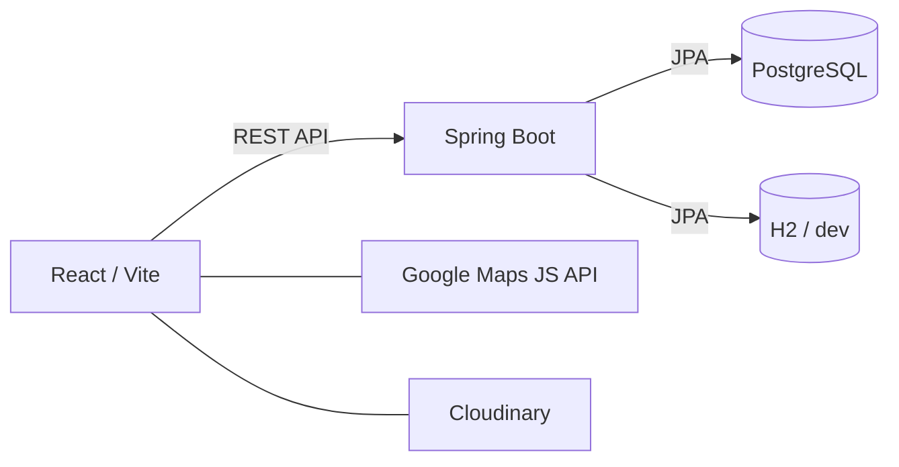

# 🚻 imatoilet

[English](README.md)

> 日本全国のトイレを、今すぐ見つける。清潔さ・バリアフリー設備・場所から絞り込めるトイレ検索Webアプリ。

<p align="center">
  
  
</p>

**困った"いま"に、いちばん近いトイレを探せるWebサービス「Imatoilet」**
現在地や指定した条件から、今すぐ使えるトイレを迅速に検索できるフルスタックWebアプリケーションです。PC・スマートフォンの両デバイスに完全対応したレスポンシブデザインを採用し、外出先でもスムーズに利用できる設計にしています。

## 🔗 デモ

[デモURL](https://imatoilet.vercel.app)

---

## ✨ 主な機能

| 機能 | 説明 |
|---|---|
| 📍 **マップ検索** | Google Maps上でトイレをインタラクティブに表示。AdvancedMarker・MarkerClustererに対応 |
| 🗾 **全国スケール対応** | 地図の表示領域（Bounding Box）で動的にAPIを叩き、日本全国どこでも検索可能 |
| ♿ **バリアフリーフィルター** | 車椅子・おむつ台・24時間・オストメイト・授乳室・ウォシュレット・無料など13項目以上で絞り込み |
| ⭐ **レビュー・コメント** | 清潔度評価つきのテキストレビューを投稿可能 |
| ❤️ **お気に入り** | よく使うトイレをローカル保存してお気に入り一覧から参照 |
| 🗺️ **ルート案内** | 現在地からトイレまでの徒歩・車ルートをGoogle Mapsで表示 |
| ✏️ **管理者向けCRUD** | トークン認証による管理者専用のトイレ情報追加・編集・削除 |
| 📱 **PWA対応** | スマートフォンにアプリとしてインストール可能 |
| 🏙️ **オープンデータ活用** | つくば市バリアフリーマップのオープンデータおよび全国主要観光地のトイレ情報を収録 |

---

## 🛠 技術スタック

### バックエンド

| レイヤー | 技術 |
|---|---|
| 言語 | Java 21 (Eclipse Temurin) |
| フレームワーク | Spring Boot 3.5.9 |
| ORM | Spring Data JPA / Hibernate |
| DBマイグレーション | Flyway 11.7.2 |
| ローカルDB | H2（インメモリ・`dev`プロファイル） |
| 本番DB | PostgreSQL |
| ビルドツール | Apache Maven 3.9.12 |
| セキュリティ | Spring Security + カスタム `AdminTokenFilter` |
| テスト | JUnit 5 + MockMvc |

### フロントエンド

| レイヤー | 技術 |
|---|---|
| フレームワーク | React 19 + Vite |
| UIコンポーネント | MUI (Material-UI) v7 |
| 地図 | Google Maps JavaScript API（`@react-google-maps/api`） |
| マーカークラスタリング | `@googlemaps/markerclusterer` |
| 画像ホスティング | Cloudinary（オプション） |
| テスト | Vitest + Testing Library |

### アーキテクチャ



---

## 💡 開発ストーリーと工夫した点

### 1. 将来を見据えたパフォーマンス対策と、AIを活用したトラブルシューティング（Google Maps API）

<p align="center">
  
  
</p>

**Google Maps APIとクラスタリングによる描画パフォーマンスの最適化**
検索結果が多数に及ぶ場合でもマップ画面が乱雑にならないよう、MarkerClustererを導入してピンをグループ化（クラスタリング）しています。これにより、大量のマーカー描画によるブラウザの負荷を軽減し、サクサク動くパフォーマンスと高い視認性を両立させました。

開発ではAIを積極的に活用しましたが、Google Maps APIのような仕様が複雑な領域では、AIの回答に古い情報や矛盾が含まれる場面に何度も直面しました。そのため「AIのコードを丸写しするのではなく、エラーログや公式ドキュメントと照合しながら原因を探る」姿勢を一貫して意識しました。将来的にデータ量が増えた際の描画負荷を見越してMarkerClustererを導入したことで、エラーから逃げずに将来の運用も見据えて実装する開発の基礎を学べました。

---

### 2. 基礎を活かしたバックエンド構築と、初挑戦のReactにおけるAPI連携

<p align="center">
  
  
</p>

**Spring Boot APIとの連携による、複雑な設備データのクリーンな描画**
バックエンド（Spring Boot）から取得した設備情報やレビューデータを、React側で適切に処理してタグや星評価としてマッピング表示しています。フロントエンドとバックエンドのシームレスなデータ連携により、ユーザーが知りたい詳細情報を一目で把握できる画面を構築しました。

Javaは以前から学習済みだったため、API設計からDB構築まで落ち着いて進められた一方、Reactは今回が初挑戦でした。最も苦労したのはフロントエンド・バックエンド間のAPI通信で、AIが提示したコードが原因でエラーが頻発しました。Javaの基礎知識を活かして問題を切り分けながら冷静に原因を追い、フロントエンドからDBまでデータが一貫して通る仕組みを自力で構築できたことは、フルスタック開発の流れを理解する上で大きな財産になりました。

---

### 3. 原体験と競合分析から生まれた、ユーザーに寄り添うUI/UX設計

<p align="center">
  
  
</p>

**高齢者や多様なユーザーに配慮したバリアフリーなUI設計**
MUI v7を採用し、「オムツ交換台」「車椅子対応」などの詳細条件を視認性の高いアイコンと直感的なトグルスイッチで表現しました。モバイルでも押しやすいボタン配置を意識し、ITリテラシーを問わず誰でも迷わず操作できるUXを実現しています。

「外出先でトイレだけをすぐ探したい」という実体験からスタートし、既存アプリを複数使い比べた競合分析を経て、最もこだわったのは「高齢者やスマホ操作に不慣れな方でも直感的に使えるシンプルさ」です。多機能化による画面の複雑さを避け、本当に必要な情報にすぐアクセスできるUIと、外出先での焦りや不安を和らげる柔らかい配色・デザインを心がけました。技術的な実装だけでなく「誰がどんな気持ちでアプリを開くか」を想像することの大切さを、この開発を通して学びました。

---

## 🚀 ローカル開発環境のセットアップ

### 必要なもの

- Java 21
- Apache Maven 3.9.12（直接インストール — **`mvnw` は使用しないこと**）
- Node.js 18以上
- Google Maps APIキー

### 1. リポジトリをクローン

```bash
git clone https://github.com/tao0524/imatoilet.git
cd imatoilet
```

### 2. バックエンドを起動（H2インメモリ・devプロファイル）

```powershell
cd backend\backend
mvn clean spring-boot:run "-Dspring-boot.run.profiles=dev"
```

バックエンド起動URL: `http://localhost:8080`

**H2コンソール**（ローカル開発時のみ）:

| 項目 | 値 |
| --- | --- |
| アクセスURL | `http://localhost:8080/h2-console` |
| JDBC URL | `jdbc:h2:mem:imatoiletdb` |
| ユーザー名 | `sa` |
| パスワード | *（空欄）* |

### 3. フロントエンドの環境変数を設定

```bash
cd toilet-frontend
cp .env.example .env
# VITE_GOOGLE_MAPS_API_KEY などを記入してください
```

### 4. フロントエンドを起動

```bash
npm install
npm run dev
```

フロントエンド起動URL: `http://localhost:5173`

---

## 🗄 データベースマイグレーション

Flywayマイグレーションは起動時に自動実行されます。
マイグレーションスクリプトの格納場所:

```
backend/src/main/resources/db/migration/       # PostgreSQL（本番）
backend/src/main/resources/db/migration-h2/    # H2（ローカル開発）
```

主なマイグレーション:

| バージョン | 内容 |
| --- | --- |
| V1 | 初期スキーマ（toilets・equipment） |
| V4 | サンプルデータ投入 |
| V9 | つくば市オープンデータ投入 |
| V11 | レビューテーブル追加 |
| V13〜V15 | 東京密集データ・観光地・全国スケールデータ追加 |

---

## 🔌 APIエンドポイント

| メソッド | エンドポイント | 説明 |
| --- | --- | --- |
| `GET` | `/api/toilets` | トイレ検索（位置情報・Bounding Box・キーワード・フィルター） |
| `GET` | `/api/toilets/{id}` | トイレ詳細取得 |
| `POST` | `/api/toilets` | トイレ追加 *（管理者トークン必須）* |
| `PUT` | `/api/toilets/{id}` | トイレ更新 *（管理者トークン必須）* |
| `DELETE` | `/api/toilets/{id}` | トイレ削除 *（管理者トークン必須）* |
| `GET` | `/api/toilets/{id}/reviews` | レビュー一覧取得 |
| `POST` | `/api/toilets/{id}/reviews` | レビュー投稿 |

### 主な検索パラメータ

| パラメータ | 型 | 説明 |
| --- | --- | --- |
| `lat` / `lng` | `Double` | 現在地座標（半径検索） |
| `radius` | `Double` | 検索半径（km、デフォルト: 5.0） |
| `minLat/maxLat/minLng/maxLng` | `Double` | Bounding Box（全国スケール検索） |
| `keyword` | `String` | 名称・住所のキーワード検索 |
| `facilityCategory` | `String` | `station`・`park`・`commercial`・`public` など |
| `equipment` | `List<String>` | `WHEELCHAIR`・`DIAPER`・`OPEN_24H`・`OSTOMATE` など |

---

## 🧪 テストの実行

```bash
# バックエンド
cd backend/backend
mvn test

# フロントエンド
cd toilet-frontend
npm run test
```

---

## 📁 ディレクトリ構成

```
imatoilet/
├── docs/                      # スクリーンショット
├── backend/backend/           # Spring Bootアプリケーション
│   ├── src/main/java/         # Controller・Service・Entity・Repository
│   ├── src/main/resources/    # application.properties・Flywayマイグレーション
│   └── src/test/              # ユニット・統合テスト
└── toilet-frontend/           # React + Viteアプリケーション
    ├── src/
    │   ├── components/        # 共有UIコンポーネント（SafeGoogleMap・ToiletCardなど）
    │   ├── hooks/             # カスタムフック（useToiletSearch）
    │   ├── pages/             # ルートページ（Home・Search・Detail・Register・Favorites）
    │   └── utils.js           # ユーティリティ（距離計算・設備情報正規化）
    └── public/                # PWAアイコン・マニフェスト
```

---

## 📝 ライセンス

MIT

---

*ポートフォリオとして個人開発しています。*