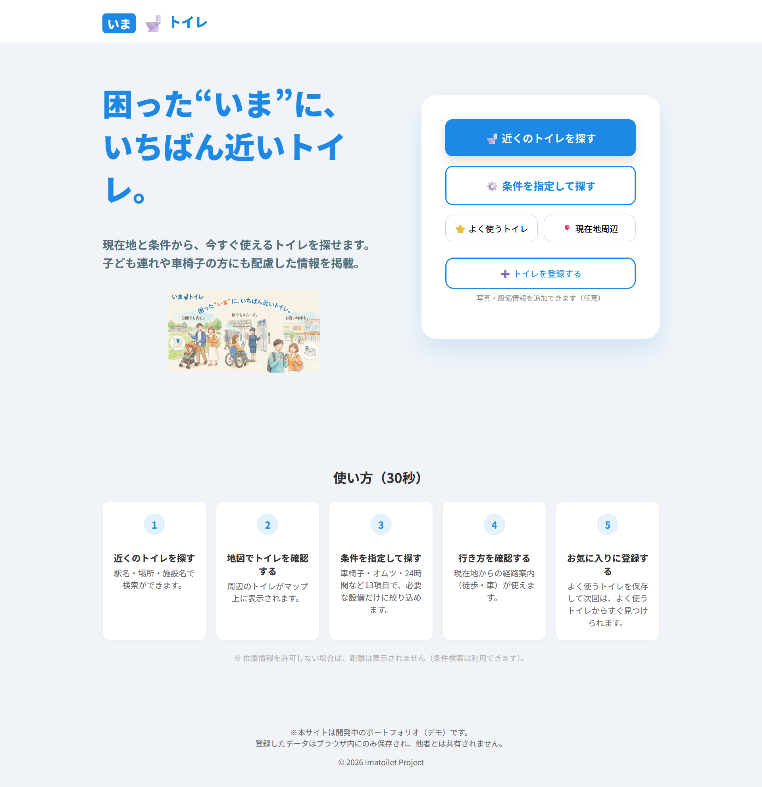
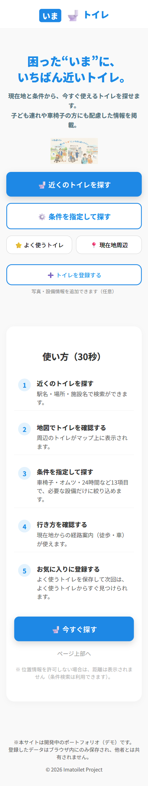
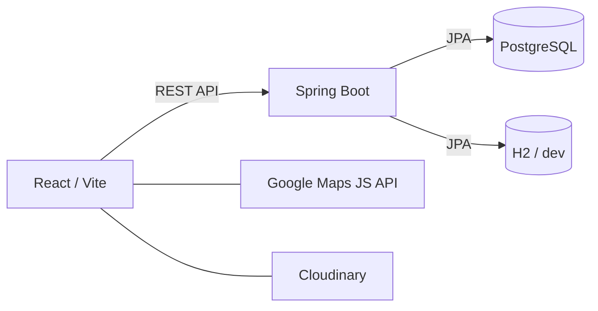
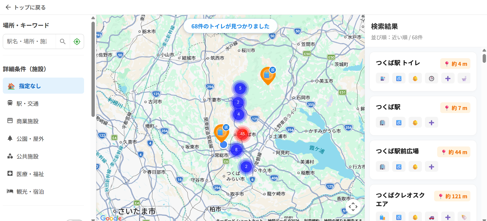
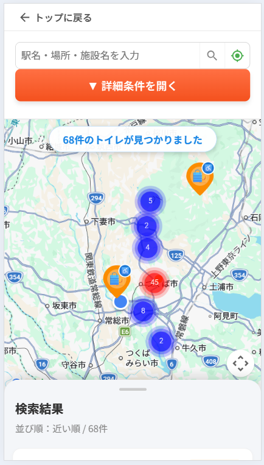
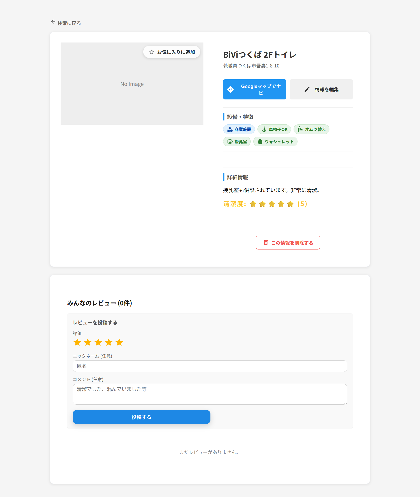
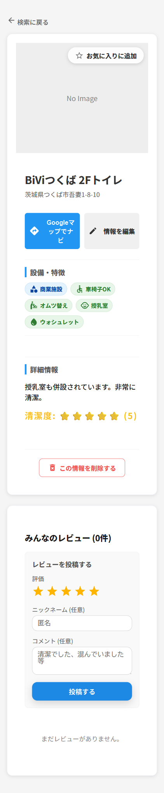
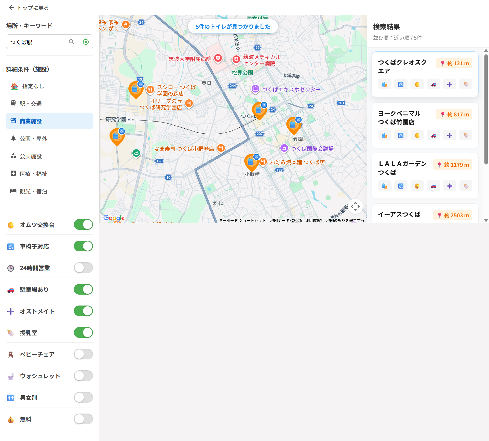
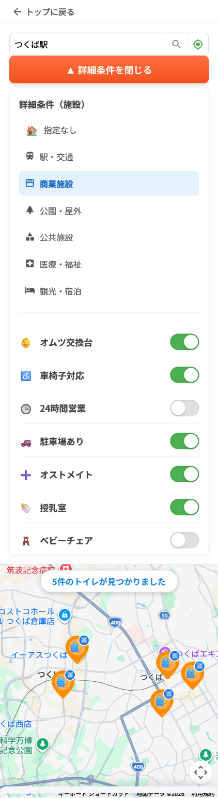

# 🚻 imatoilet

[日本語](README.ja.md)

[](https://imatoilet.vercel.app)
[](https://github.com/tao0524/imatoilet)
[](LICENSE)
[](https://sentry.io)
[](https://github.com/tao0524/imatoilet/actions/workflows/ci.yml)

> Find the nearest toilet in Japan, right now. A toilet search web app with filtering by cleanliness, accessibility features, and location.

<p align="center">
  
  
</p>

**"Imatoilet" — find the nearest toilet when you need it most.**
A full-stack web application that quickly locates available toilets based on your current location and specified conditions. Fully responsive for both PC and smartphones, designed for smooth use on the go.

## 🔗 Demo

[Live Demo](https://imatoilet.vercel.app)

---

## ✨ Features

| Feature | Description |
|---|---|
| 📍 **Map Search** | Interactively display toilets on Google Maps with AdvancedMarker and MarkerClusterer support |
| 🗾 **Nationwide Coverage** | Dynamically queries the API by map viewport (Bounding Box), covering all of Japan |
| ♿ **Accessibility Filters** | Filter by 13+ criteria: wheelchair access, diaper changing, 24h availability, ostomate, nursing room, washlet, free, and more |
| ⭐ **Reviews & Comments** | Post text reviews with a cleanliness rating |
| ❤️ **Favorites** | Save frequently used toilets locally and access them from a favorites list |
| 🗺️ **Route Navigation** | Display walking and driving routes from your current location via Google Maps |
| ✏️ **Admin CRUD** | Add, edit, and delete toilet information via token-authenticated admin access |
| 📱 **PWA Support** | Installable as an app on smartphones |
| 🏙️ **Open Data Integration** | Includes Tsukuba City barrier-free map open data and toilet information for major tourist spots nationwide |

---

## 🛠 Tech Stack

### Backend

| Layer | Technology |
|---|---|
| Language | Java 21 (Eclipse Temurin) |
| Framework | Spring Boot 3.5.9 |
| ORM | Spring Data JPA / Hibernate |
| DB Migration | Flyway 11.7.2 |
| Local DB | H2 (in-memory, `dev` profile) |
| Production DB | PostgreSQL |
| Build Tool | Apache Maven 3.9.12 |
| Security | Spring Security + custom `AdminTokenFilter` |
| Testing | JUnit 5 + MockMvc |

### Frontend

| Layer | Technology |
|---|---|
| Framework | React 19 + Vite |
| UI Components | MUI (Material-UI) v7 |
| Maps | Google Maps JavaScript API (`@react-google-maps/api`) |
| Marker Clustering | `@googlemaps/markerclusterer` |
| Image Hosting | Cloudinary (optional) |
| Error Monitoring | Sentry (`@sentry/react`) |
| Testing | Vitest + Testing Library |

### Architecture



---

## 💡 Development Story & Key Decisions

### 1. Performance Optimization and AI-Assisted Troubleshooting (Google Maps API)

<p align="center">
  
  
</p>

**Rendering performance optimization with Google Maps API and MarkerClusterer**
To prevent the map from becoming cluttered when many results are returned, I introduced MarkerClusterer to group pins together. This reduces browser rendering load from large numbers of markers, achieving both smooth performance and high visual clarity.

Throughout development I made active use of AI assistance, but in complex domains like the Google Maps API, I repeatedly encountered responses containing outdated information or contradictions. This reinforced the habit of cross-referencing AI-generated code against error logs and official documentation rather than copying it blindly. Proactively introducing MarkerClusterer to handle future data growth taught me the fundamentals of building with long-term operability in mind.

---

### 2. Leveraging Backend Knowledge While Learning React from Scratch

<p align="center">
  
  
</p>

**Clean rendering of complex facility data via Spring Boot API integration**
Equipment information and review data fetched from the Spring Boot backend are processed on the React side and mapped into readable tags and star ratings. This seamless frontend-backend data integration produces a detail screen where users can grasp all the information they need at a glance.

Java was already familiar to me, so I could approach the API design and database setup calmly, while React was a completely new challenge. The hardest part was the API communication bridging the two environments — AI-generated code frequently caused errors, and I had to isolate and debug issues methodically. Leveraging my Java knowledge to trace problems from the backend outward, and ultimately building a consistent data flow from frontend to database on my own, gave me a solid end-to-end understanding of full-stack development.

---

### 3. User-Centered UI/UX Born from Personal Experience and Competitor Analysis

<p align="center">
  
  
</p>

**Barrier-free UI design considerate of elderly users and diverse needs**
Built with MUI v7, detailed conditions such as "diaper changing table" and "wheelchair access" are expressed through high-visibility icons and intuitive toggle switches. Button placement is optimized for mobile usability, delivering a friendly UX that anyone can operate without confusion, regardless of digital literacy.

The project started from a personal experience of needing to find a toilet quickly while out. After discovering that many similar apps already existed, I downloaded and compared several of them rather than giving up — and concluded that the most important differentiator was **simplicity that even elderly or less tech-savvy users can navigate intuitively**. I avoided feature bloat that would complicate the interface, prioritized quick access to essential information (accessibility features, distance), and kept the overall design soft and welcoming to ease the anxiety of urgently needing a restroom. This project taught me that imagining who opens the app and how they feel is just as important as the technical implementation.

---

## 🚀 Local Development Setup

### Prerequisites

- Java 21
- Apache Maven 3.9.12 (install directly — **do not use `mvnw`**)
- Node.js 18+
- Google Maps API key

### 1. Clone the repository

```bash
git clone https://github.com/tao0524/imatoilet.git
cd imatoilet
```

### 2. Start the backend (H2 in-memory, dev profile)

```powershell
cd backend\backend
mvn clean spring-boot:run "-Dspring-boot.run.profiles=dev"
```

Backend URL: `http://localhost:8080`

**H2 Console** (local development only):

| Item | Value |
| --- | --- |
| Access URL | `http://localhost:8080/h2-console` |
| JDBC URL | `jdbc:h2:mem:imatoiletdb` |
| Username | `sa` |
| Password | *(leave blank)* |

### 3. Configure frontend environment variables

```bash
cd toilet-frontend
cp .env.example .env
# Fill in VITE_GOOGLE_MAPS_API_KEY and other values
```

### 4. Start the frontend

```bash
npm install
npm run dev
```

Frontend URL: `http://localhost:5173`

---

## 🗄 Database Migrations

Flyway migrations run automatically on startup.
Migration scripts are located at:

```
backend/src/main/resources/db/migration/       # PostgreSQL (production)
backend/src/main/resources/db/migration-h2/    # H2 (local development)
```

Key migrations:

| Version | Content |
| --- | --- |
| V1 | Initial schema (toilets & equipment) |
| V4 | Sample data seed |
| V9 | Tsukuba City open data import |
| V11 | Reviews table added |
| V13–V15 | Tokyo dense data, tourist spots, nationwide scale data |

---

## 🔌 API Endpoints

| Method | Endpoint | Description |
| --- | --- | --- |
| `GET` | `/api/toilets` | Search toilets (location, Bounding Box, keyword, filters) |
| `GET` | `/api/toilets/{id}` | Get toilet details |
| `POST` | `/api/toilets` | Add toilet *(admin token required)* |
| `PUT` | `/api/toilets/{id}` | Update toilet *(admin token required)* |
| `DELETE` | `/api/toilets/{id}` | Delete toilet *(admin token required)* |
| `GET` | `/api/toilets/{id}/reviews` | Get review list |
| `POST` | `/api/toilets/{id}/reviews` | Post a review |

### Key Search Parameters

| Parameter | Type | Description |
| --- | --- | --- |
| `lat` / `lng` | `Double` | Current location coordinates (radius search) |
| `radius` | `Double` | Search radius in km (default: 5.0) |
| `minLat/maxLat/minLng/maxLng` | `Double` | Bounding Box (nationwide search) |
| `keyword` | `String` | Keyword search by name or address |
| `facilityCategory` | `String` | `station`, `park`, `commercial`, `public`, etc. |
| `equipment` | `List<String>` | `WHEELCHAIR`, `DIAPER`, `OPEN_24H`, `OSTOMATE`, etc. |

---

## 🧪 Running Tests

```bash
# Backend
cd backend/backend
mvn test

# Frontend
cd toilet-frontend
npm run test
```

---

## 📁 Directory Structure

```
imatoilet/
├── docs/                      # Screenshots
├── backend/backend/           # Spring Boot application
│   ├── src/main/java/         # Controller, Service, Entity, Repository
│   ├── src/main/resources/    # application.properties, Flyway migrations
│   └── src/test/              # Unit and integration tests
└── toilet-frontend/           # React + Vite application
    ├── src/
    │   ├── components/        # Shared UI components (SafeGoogleMap, ToiletCard, etc.)
    │   ├── hooks/             # Custom hooks (useToiletSearch)
    │   ├── pages/             # Route pages (Home, Search, Detail, Register, Favorites)
    │   └── utils.js           # Utilities (distance calculation, equipment normalization)
    └── public/                # PWA icons and manifest
```

---

## 🔒 Security & Monitoring

### Error Monitoring (Sentry)

`@sentry/react` is integrated into the frontend. Runtime errors are automatically captured and reported to Sentry, enabling real-time visibility into production issues.

- Initialized in `main.jsx` with `tracesSampleRate: 0.2`
- Active in production only (`enabled: import.meta.env.PROD`)
- `ErrorBoundary` component calls `Sentry.captureException()` for React rendering errors
- `sendDefaultPii` is intentionally set to `false` to protect user privacy

### CD (Continuous Deployment)

Automatic deployment is configured for both frontend and backend:

| Service | Platform | Trigger |
| --- | --- | --- |
| Frontend | Vercel | Push to `main` branch |
| Backend | Railway | Push to `main` branch |

Average build time: 15–28 seconds.

### API Key Security

- All API keys and secrets are managed exclusively via environment variables (`.env` / Vercel / Railway settings)
- API keys are **never** hardcoded in source files
- The Google Maps API key is restricted by HTTP referrer in the Google Cloud Console

### Git History Sanitization

A previously exposed Google Maps API key was fully removed from the entire Git history using `git filter-repo`. The repository has been force-pushed to GitHub with a clean history.

### GitGuardian Integration

This repository is connected to [GitGuardian](https://www.gitguardian.com/) for automated secret detection. Any accidental commit of secrets triggers an immediate alert.

---

## 📝 License

MIT

---

*Developed as a personal portfolio project.*